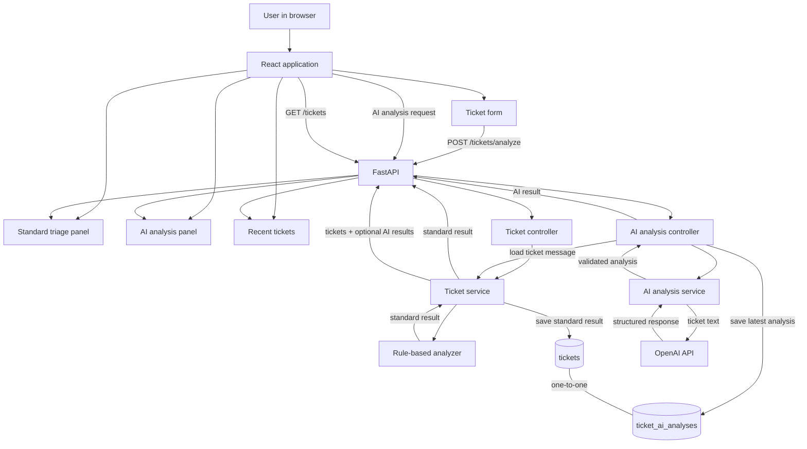

# ResolveIQ

ResolveIQ is a full-stack support workflow that classifies incoming ticket text, assigns urgency, sets a priority level, and stores results for review.

It is intentionally simple and explainable:
- FastAPI + SQLAlchemy + PostgreSQL on the backend
- React + Vite on the frontend
- Rule-based standard triage, with optional OpenAI ticket analysis

## Quick Start
From the repository root:
```bash
cd ticket-triage
cp .env.example .env
docker compose up --build
# Frontend: http://localhost:3000
# Backend API: http://localhost:8000
# API Docs: http://localhost:8000/docs
```

Add your OpenAI API key to `ticket-triage/.env` to enable automatic AI analysis after standard triage. Standard rule-based triage works without a key. Never put the key in frontend code or commit `.env`.

AI results are stored separately for each ticket and appear in the Recent Tickets section. The endpoint is `POST /tickets/{ticket_id}/ai-analysis`; its response is documented in `/docs`. See [ticket-triage/README.md](ticket-triage/README.md#optional-openai-analysis) for details.

## Architecture Overview
The standard and AI analyses are independent paths. Both use the saved ticket, but each result is stored separately.



Backend responsibilities are split by layer:
- Controller: receives HTTP requests, validates payloads, returns response models
- Service: coordinates analysis + persistence and manages transaction boundaries
- Analyzer: pure heuristic engine (stateless, deterministic)
- Model: SQLAlchemy ORM mapping for storage

In short: Controller handles HTTP, Service handles persistence, Analyzer handles intelligence, Model handles DB structure.

## API Reference
- POST /tickets/analyze - Analyze a ticket and persist the result
- POST /tickets/{ticket_id}/ai-analysis - Analyze and save AI output for a ticket
- GET /tickets?limit=50 - Fetch recent analyzed tickets
- GET /health - Basic health check
- GET /docs - Swagger/OpenAPI UI

## NLP / Classification Approach
The classification engine is rule-based and fully local.

How categorization works:
- Ticket text is normalized to lowercase
- Each category gets a score based on matched keywords
- Highest score wins
- Tie-break order: Security > Billing > Technical > Account > Feature Request > Other
- If nothing matches, category falls back to Other

How urgency works:
- Urgency becomes true if any urgency keyword is present

How priority works:
1. If any P0 signal is present, priority is P0
2. Else if any P1 signal is present, priority is P1
3. Else if urgency is true and no P2 signals exist, priority is P1
4. Else if any P2 signal is present, priority is P2
5. Else if any P3 signal is present, priority is P3
6. Else default is P2

How confidence score is calculated:
- matched_keywords_in_winning_category / total_keywords_in_that_category
- clamped to [0.1, 1.0]
- rounded to 2 decimals
- if category is Other (no match), confidence is fixed at 0.1

This design keeps decisions explainable via matched signals and extracted keywords.

## Custom Rule: Security Escalation
Security is treated as a hard-override workflow.

If a ticket matches security keywords:
- category is treated as Security (or security context is detected)
- priority is forced to P0
- urgency is forced to true
- is_security_escalated is set to true

Why this is strict: security incidents (breaches, hacks, leaked data, SQL injection, unauthorized access) should not wait in normal queues. Fast escalation helps reduce blast radius and supports compliance requirements.

Example:
- "I found a SQL injection in your login page" -> Category: Security, Priority: P0, Escalated: true

## Running Tests
```bash
cd ticket-triage/backend
pip install -r requirements.txt
pytest tests/ -v --tb=short
```

Tip: If local Python/package compatibility is different on your machine, run tests through Docker:

```bash
cd ticket-triage
docker compose run --rm backend pytest tests/ -v --tb=short
```

## Reflection (Design Decisions, Trade-offs, Limitations, What I'd Improve)

### Design Decisions
- FastAPI was chosen for quick API development, strong validation, and OpenAPI docs out of the box.
- PostgreSQL was preferred over SQLite for production behavior and containerized consistency.
- Keyword rules are config-driven in keywords.py so updates do not require touching analyzer logic.
- Layered architecture (controller/service/analyzer) keeps responsibilities clear and testable.

### Trade-offs
- Rule-based matching is transparent and fast, but it can produce false positives in ambiguous text.
- Confidence score reflects keyword density within a category, not true model probability.
- No stemming/lemmatization means wording variants (for example, crashed vs crash) may be missed.

### Limitations
- Keyword lists require periodic maintenance as user language evolves.
- There is no learning loop from previously resolved tickets.
- Confidence is a heuristic signal, not statistically calibrated confidence.

### What I'd Improve With More Time
- Add local semantic ranking (for example TF-IDF or sentence-transformers) while keeping explainability.
- Add ticket lifecycle states (open, in-progress, resolved, closed) and editing workflows.
- Add JWT-based authentication and role-aware access.
- Introduce proper DB migrations with Alembic revision flow.
- Add pagination/filtering for ticket history APIs.
- Add WebSocket push for real-time ticket updates on the dashboard.
- Add API rate limiting and abuse protection.

## Maintainer

ResolveIQ is developed and maintained by Piyush Dhakad.
